<div align="center">

# Speculative Decoder

### Can a small model help a big one write faster without changing a single word?

A from-scratch implementation and honest benchmark of **speculative decoding** for language models,<br>
with a paged KV cache, exact accept-reject sampling, and a measured answer to *when it actually helps*.

[](https://github.com/beriltatli/speculative-decoder/actions/workflows/ci.yml)
[](.python-version)
[](requirements.txt)
[](requirements.txt)
[](LICENSE)
<br>
[](#sanity-checks)
[](#reproducibility)
[](#roadmap)
[-1baf7a)](#greedy-identity)
[](#speed)

<br>

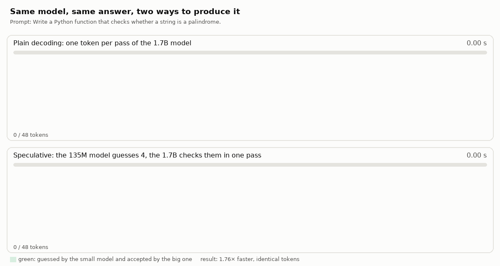

<sub>A real run of <code>scripts/demo.py</code> on an Apple M3: the same 48 tokens, 1.76× sooner. Green text was guessed by the 135M model and approved by the 1.7B one.
Totals are measured; the pace inside each run is spread evenly. <a href="figures/race.mp4">▶ Watch as MP4</a></sub>

<br><br>

<a href="media/speculative-decoding-explainer.mp4"></a>

<sub>🎬 <b>New to this?</b> A narrated 4-minute, 1080p walkthrough with no maths required: the problem, one guess-and-check round, the KV cache, paged memory, and how correctness was tested. <a href="media/speculative-decoding-explainer.mp4">media/speculative-decoding-explainer.mp4</a> (49 MB)</sub>

</div>

---

## Contents

<table>
<tr>
<td valign="top" width="33%">

**Understand it**
- [Video explainer](media/speculative-decoding-explainer.mp4) (4 min)
- [The idea in one minute](#the-idea-in-one-minute)
- [Words you will meet](#words-you-will-meet)
- [How one round works](#how-one-round-works)
- [Why it is exact](#why-the-output-does-not-change)
- [A real round, token by token](#a-real-round-token-by-token)

</td>
<td valign="top" width="33%">

**See the results**
- [Results at a glance](#results-at-a-glance)
- [Speed](#speed)
- [Where the stopwatch stops](#where-the-stopwatch-stops-decides-the-ttft)
- [Cache block size](#cache-block-size)
- [Batch size](#batch-size)
- [Correctness](#correctness)

</td>
<td valign="top" width="33%">

**Use it**
- [Quick start](#quick-start)
- [Try it yourself](#try-it-yourself)
- [Reproduce every number](#reproduce-every-number)
- [Project map](#project-map)
- [Roadmap](#roadmap)
- [FAQ](#faq) · [References](#references)

</td>
</tr>
</table>

---

## The idea in one minute

A language model writes text **one token at a time** (a token is a word or a piece of one). For every token, the whole model has to run once. A 1.7-billion-parameter model on a laptop needs about 66 ms per token, so a paragraph takes seconds, and most of that time is spent *reading the model's weights from memory*, not doing arithmetic.

Speculative decoding uses that spare arithmetic. Picture a senior author and a fast junior assistant:

| | The analogy | In this repo |
|:--|:--|:--|
| ✍️ | The **assistant** quickly drafts the next few words. | A small **draft** model (SmolLM2-135M), or a model-free *prompt lookup* that copies from earlier text, proposes **k = 4** tokens. |
| 🔍 | The **author** reads all of them at once and keeps the ones they would have written themselves. | The big **target** model (SmolLM2-1.7B) checks all 4 in **one** forward pass, which costs barely more than producing 1 token. |
| ✂️ | At the first word the author disagrees with, they cross it out and write their own. | The first rejected token is replaced by the target's choice, and everything after it is thrown away. |
| 🎁 | If every draft word was right, the author adds one more word for free. | If all k are accepted, the same pass yields a **bonus** token: up to k + 1 tokens per pass. |

The result is **the same text the big model would have written alone**: token for token at temperature 0, and the same probability distribution when sampling. Only the time changes. How much it changes depends on how often the assistant guesses right, and that is what this repository measures.

> [!TIP]
> **Short version of the findings:** on repetitive text (logs, boilerplate) the speedup reaches **1.97×**; on code about **1.2–1.3×**; on ordinary prose it can be **slightly slower** than not speculating. And the advantage shrinks as more requests are batched together.

---

## Words you will meet

<details open>
<summary><b>Glossary</b> (click to collapse)</summary>

| Term | Plain-language meaning |
|:--|:--|
| **Token** | A chunk of text the model reads and writes: a word, part of a word, or a symbol. `palindrome` is three tokens here: `pal`, `ind`, `rome`. |
| **Target model** | The big, accurate model whose output we want: SmolLM2-1.7B-Instruct. |
| **Draft model** | The small, fast guesser: SmolLM2-135M-Instruct, about 13× smaller, same vocabulary. |
| **Prompt lookup** (`spec_ngram`) | A guesser with no model at all: it finds the last few tokens earlier in the text and proposes whatever followed them there. Free, and very good on repetitive text. |
| **k** | How many tokens the guesser proposes per round. 4 throughout, unless stated. |
| **Acceptance rate α** | The share of guessed tokens the target keeps. α = 0.6 means 6 of every 10 guesses survive. |
| **Forward pass** | One run of a model over some tokens. The target's forward pass is the expensive unit everything is counted in. |
| **KV cache** | A memory of the work already done on earlier tokens (their *keys* and *values*), so each new token does not re-read the whole prompt. Without it, long prompts are ~8× slower end to end. |
| **Paged cache / block size** | The cache is handed out in fixed-size blocks, like pages of memory, instead of one big slab per request. Block size = tokens per block. |
| **Rollback** | Deleting the cache entries of rejected draft tokens so the next round starts clean. |
| **Greedy decoding** | Always picking the single most likely next token (temperature 0). Deterministic, so outputs can be compared exactly. |
| **TTFT** | *Time to first token*: how long until the first word appears. |
| **TPOT** | *Time per output token*: the average gap between later tokens. |
| **E2E** | *End-to-end*: total time for the whole answer. Speedups here are E2E. |
| **p50 / p99** | Median and 99th percentile: the typical time, and the time that only 1 run in 100 exceeds. |
| **bf16 / fp32 / fp64** | Number formats with about 3, 7 and 16 significant decimal digits. bf16 fits in memory; fp64 is used to prove exactness. |
| **MPS** | Apple's GPU backend for PyTorch. Everything here was measured on an M3 laptop with 8 GB of memory. |

</details>

---

## How one round works

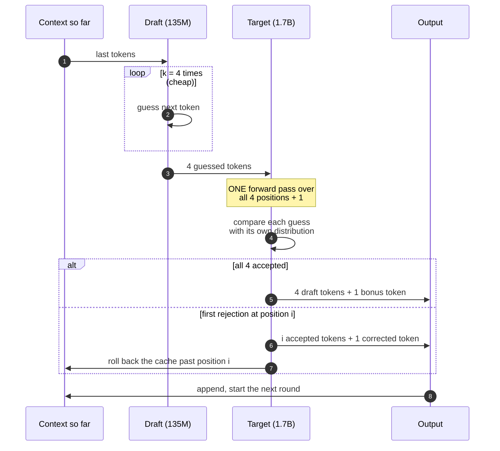

Each round always produces **at least 1** token (the target's own) and **at most k + 1**. If the guesser is right with probability α at each position, the expected number of tokens per target pass is

$$
\mathbb{E}[\text{tokens per round}] = \frac{1 - \alpha^{k+1}}{1 - \alpha}
$$

<picture>
  <source media="(prefers-color-scheme: dark)" srcset="figures/theory.dark.png">
  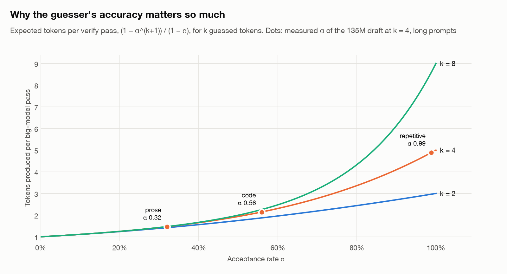
</picture>

The curve explains most of the results below: at α ≈ 0.3 a round yields only ~1.5 tokens, which does not repay the cost of running the draft four times. At α ≈ 1 it yields ~5.

### The decision at each position

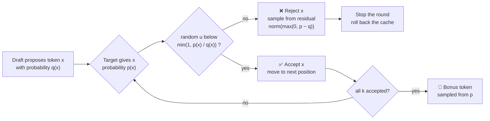

At temperature 0 this reduces to a simple rule: **accept the draft token if and only if it is the target's top choice.**

### Why the output does not change

The accept rule is not a heuristic; it is the speculative sampling algorithm of [Leviathan et al. (2023)](#references) and [Chen et al. (2023)](#references), implemented in [`spec/accept.py`](spec/accept.py). For any token x:

| Path to emitting x | Probability |
|:--|:--|
| Draft proposes x and it is accepted | q(x) · min(1, p(x)/q(x)) = **min(p(x), q(x))** |
| Draft is rejected, x drawn from the residual | β · max(0, p(x) − q(x)) / β = **max(0, p(x) − q(x))** |
| **Total** | min(p, q) + max(0, p − q) = **p(x)**, exactly the target's distribution |

That sum is the whole guarantee, and it holds *whatever* the draft is: a good model, a bad model, or a one-hot prompt-lookup guess. A tempting shortcut, resampling from p instead of the residual, counts some mass twice and quietly drifts the text toward the draft. [The tests catch that bug](#distribution-preservation) with a total-variation distance of 0.168 against 0.007 for the correct rule.

---

## A real round, token by token

These are the actual rounds from the demo run in the animation above (prompt: *"Write a Python function that checks whether a string is a palindrome."*, greedy, k = 4). The target's prefill produced the first token, `Here`; after that:

| Round | Draft guessed and target **accepted** | Target's own token | Tokens this pass |
|--:|:--|:--|--:|
| 1 | — (first guess rejected) | `'s` | 1 |
| 2 | `␣a` | `␣simple` | 2 |
| 3 | `␣Python` `␣function` `␣that` `␣checks` | `␣whether` 🎁 | 5 |
| 4 | `␣a` `␣string` `␣is` `␣a` | `␣pal` 🎁 | 5 |
| 5 | `ind` `rome` `:` `↵` | `↵` 🎁 | 5 |
| 6 | <code>```</code> `python` `↵` `def` | `␣is` 🎁 | 5 |
| 7 | `_` `pal` `ind` `rome` | `(` 🎁 | 5 |
| 8 | `s` `):` `↵␣␣␣` | `␣s` | 4 |
| 9 | `␣=` `␣''.` `join` `(` | `c` 🎁 | 5 |
| 10 | `␣for` `␣c` `␣in` `␣s` | `␣if` 🎁 | 5 |
| 11 | `␣c` `.` `is` `al` | `num` 🎁 | 5 |

48 tokens in **12 target passes** instead of 48. The three prompts of that run, side by side (one run each, so expect noise of ±10%):

| Prompt | Plain decoding | Draft model (135M) | Prompt lookup | Same tokens? |
|:--|--:|--:|--:|:--:|
| *Write a Python function that checks whether a string is a palindrome.* | 2.97 s | **1.69 s · 1.76×** · α 0.82 | 2.74 s · 1.09× · α 0.07 | ✅ all three |
| *Tell me a short story about a lighthouse keeper.* | 3.00 s | 3.13 s · 0.96× · α 0.32 | 3.19 s · 0.94× · α 0.00 | ✅ all three |
| *Repeat this line five times: GET /index.html 200 OK* | 2.41 s | 1.38 s · 1.75× · α 1.00 | **0.80 s · 3.02×** · α 0.86 | ✅ all three |

The story prompt shows the failure mode: the draft agrees with the target on `upon a time,` and then guesses wrong on most words of an invented story, so 8 of its 21 rounds yield a single token and the draft's work is wasted.

---

## Results at a glance

<table>
<tr>
<td align="center" width="25%"><h3>1.97×</h3>best end-to-end speedup<br><sub>prompt lookup, long repetitive text</sub></td>
<td align="center" width="25%"><h3>0.95×</h3>worst case: slower<br><sub>draft model, long prose</sub></td>
<td align="center" width="25%"><h3>8×</h3>what the KV cache alone buys<br><sub>300–600-token prompts</sub></td>
<td align="center" width="25%"><h3>0</h3>changed tokens in fp64<br><sub>50/50 real-weight prompts</sub></td>
</tr>
</table>

| Question | Answer from the measurements |
|:--|:--|
| Does speculative decoding change the output? | **No.** Exact identity in fp64 on real weights (50/50) and on a tiny model (200/200); the bf16 flips (6/200) are [rounding ties](#bf16-flips-are-rounding-not-the-algorithm), not the algorithm. Sampling matches the target's distribution within noise. |
| Is it faster? | **It depends on the text.** 1.3–2.0× on repetitive text, 1.1–1.3× on code, 0.95–1.1× on prose. |
| Which guesser is better? | Prompt lookup wins on repetitive text (no model to run); the 135M draft wins on short code; neither helps prose. |
| Does it help when serving many users at once? | **Less and less.** By batch 4 the draft model is at or below plain decoding everywhere. |
| What matters more, speculation or caching? | **Caching**, by far, on long prompts: 7.7–8.3× versus at most 1.97×. |
| Is this implementation as fast as `transformers`' own? | **No.** `transformers` assisted generation beats this loop on every cell, with the same models and tokens. The gap is overhead here, [not yet profiled](#roadmap). |

---

## Speed

SmolLM2-1.7B-Instruct target, SmolLM2-135M-Instruct draft, both bf16 with fp32 logits, on an Apple M3 with 8 GB (MPS). Batch size 1, k = 4, 32 new tokens, greedy. Each cell has 3 warmup rounds and 100 measured rounds, with the method order shuffled every round. Long prompts are 300–600 tokens; short ones are 9–167. Speedup is the cached baseline's end-to-end p50 divided by the method's; α is the fraction of drafted tokens accepted.

<picture>
  <source media="(prefers-color-scheme: dark)" srcset="figures/speedup.dark.png">
  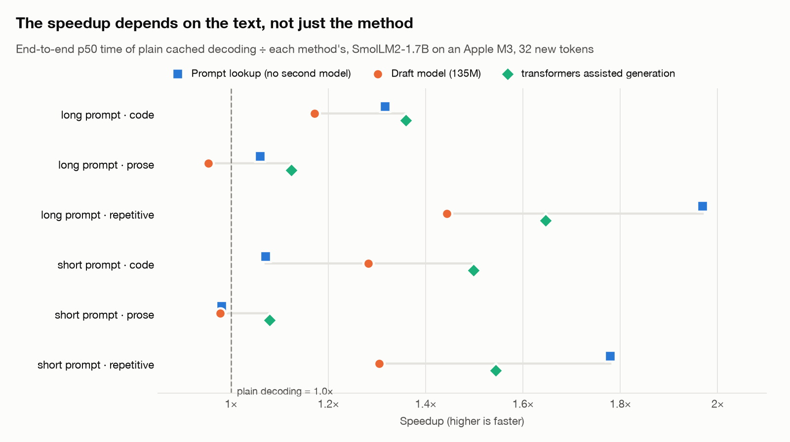
</picture>

The six methods compared:

| Method | What it does | Why it is here |
|:--|:--|:--|
| `no_cache` | Recomputes the whole prefix for every token. | The floor: shows what the KV cache is worth. |
| `cached` | Plain one-token-at-a-time decoding with the paged KV cache. | **The real baseline.** Every speedup is relative to it. |
| `spec_ngram` | Speculative decoding with prompt lookup as the guesser. | A guesser that costs nothing. |
| `spec_draft` | Speculative decoding with the 135M draft model. | The classic setup. |
| `spec_self` | Speculative decoding where the target drafts for itself. | A sanity check: acceptance is 1.00 but every round pays twice, so it **must** come out slower. |
| `hf_assisted` | `transformers`' built-in assisted generation, same models. | The one outside reference row. |

| Method | long / code | long / prose | long / repetitive | short / code | short / prose | short / repetitive |
|:--|--:|--:|--:|--:|--:|--:|
| `cached` E2E p50 (ms) | 2,726 | 2,705 | 2,847 | 1,808 | 1,796 | 1,940 |
| `no_cache` | 0.13× | 0.13× | 0.12× | 0.59× | 0.64× | 0.32× |
| `spec_ngram` | 1.32× (α 0.19) | 1.06× (α 0.05) | **1.97×** (α 0.63) | 1.07× (α 0.06) | 0.98× (α 0.04) | 1.78× (α 0.32) |
| `spec_draft` | 1.17× (α 0.56) | 0.95× (α 0.32) | 1.44× (α 0.99) | 1.28× (α 0.64) | 0.98× (α 0.37) | 1.30× (α 0.69) |
| `hf_assisted` | 1.36× | 1.12× | 1.65× | 1.50× | 1.08× | 1.54× |
| `spec_self` | 0.72× | 0.73× | 0.71× | 0.84× | 0.84× | 0.80× |

- **The speedup follows the text, not the method.** On prose the draft model's acceptance falls to 0.32–0.37, and it ends up 2–5% slower than plain cached decoding on both prompt lengths. On repetitive text it reaches 1.30–1.44×, and the prompt-lookup draft, which needs no second model, reaches 1.78–1.97×. Acceptance is ordered repetitive > code > prose under both conditions.
- **The cache is the larger win, but only for long prompts.** Without it, 300–600-token prompts are 7.7–8.3× slower end to end; on 9–36-token prompts the gap is 1.6–1.7×.
- **`transformers`' assisted path beats this loop on every cell**: 1.36× against 1.17× on long code, and 1.12× against 0.95× on long prose. Both run the same models and emit the same tokens, so the difference is overhead in this implementation. The likely sources are the gather copy of every cached position per layer per step (`cache/kv.py`) and the device-to-host copy of each draft distribution. Neither has been profiled yet.
- **`spec_self` is slower everywhere (0.71–0.84×), as it must be.** It drafts with the target itself, so acceptance is 1.00 and every round pays for the model twice. A harness that showed it faster would be measuring something other than the work done.

<picture>
  <source media="(prefers-color-scheme: dark)" srcset="figures/acceptance.dark.png">
  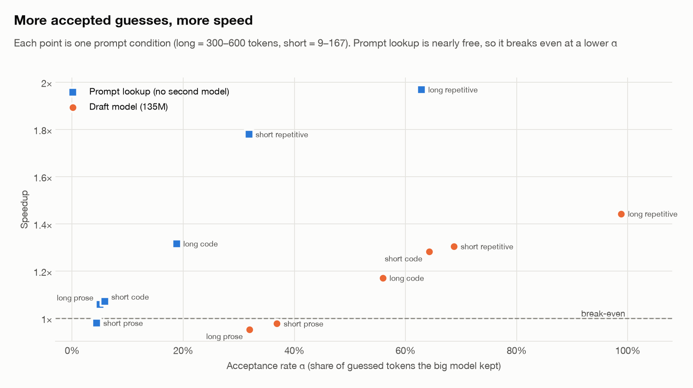
</picture>

The two guessers sit on different curves because they cost different amounts. Prompt lookup is a string search, so even α 0.19 buys 1.32× on long code. The draft model runs a neural network four times per round, so it needs roughly α ≈ 0.4 just to break even.

<picture>
  <source media="(prefers-color-scheme: dark)" srcset="figures/tpot.dark.png">
  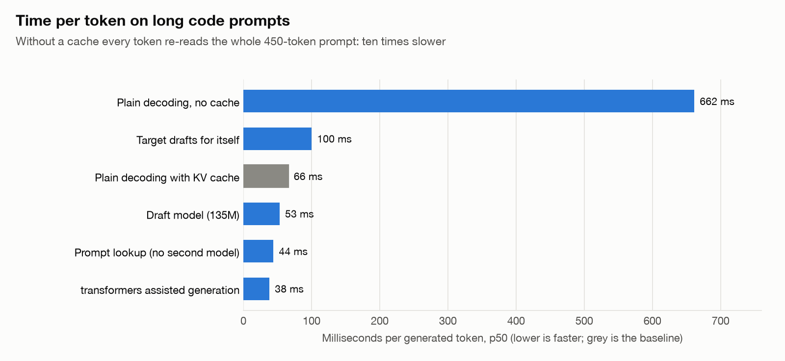
</picture>

### Where the stopwatch stops decides the TTFT

This loop emits the first token from the target's prefill, before the draft runs. Speculative decoding then costs nothing in TTFT, and the draft's one-time prefill is spread across every token of TPOT. Stopping the stopwatch at the end of the first speculative round instead moves the draft's prefill, its k steps and the first verify into TTFT. It also biases TPOT low: the round's time leaves the numerator, but its tokens stay in the denominator. `transformers`' assisted path can only be measured the second way, because it emits nothing before its first round. Both definitions are computed from the same Phase 4 run and reported side by side, with the draft prefill and end-to-end latency as separate columns. Definitions: [`bench/latency.py`](bench/latency.py).

```text
One speculative request, long code prompt (p50 times, ms; medians do not add exactly)

  0                       706  786    975                                     2,327
  ├────────────────────────┼────┼──────┼─────────────────────────────────────────┤
  ████████████████████████                                                         target prefill → first token
                           ████                                                    draft prefill
                                ██████                                             round 1: 4 drafts + 1 verify
                                       ██████████████████████████████████████████  rounds 2… until 32 tokens

  TTFT, first-token definition: from 0 to 706  ·  TTFT, first-round definition: from 0 to 975
```

| Definition | Speculative TTFT (long code) | Speculative TPOT | Cached baseline TTFT |
|:--|--:|--:|--:|
| First token (prefill) | **706 ms** (+3%) | 53.2 ms | 689 ms |
| End of first round | **975 ms** (+41%) | 43.2 ms | 689 ms |
| `hf_assisted` (only measurable this way) | 838 ms | 38.3 ms | — |

On the 135M draft, the first-token definition puts speculative TTFT within 3% of the cached baseline (706 against 689 ms on long code prompts). The first-round definition puts it 41% above (975 ms), and lowers its TPOT from 53.2 to 43.2 ms. On short prompts, where prefill is cheap, the first-round TTFT is three times the first-token one (255 against 85 ms). The assisted path's TTFT (838 ms on long code) is a first-round number and compares with 975, not with 706.

### Sanity checks

[`tests/test_bench_sanity.py`](tests/test_bench_sanity.py) runs on this file: 252 of its checks pass and 4 fail. The failures are reported here, and their thresholds were not loosened.

- **The cache is not the first-order win on short prompts** (3 failures). The check asks for a no-cache TPOT at least 5× the cached one. On 9–36-token prompts the ratio is 1.6–1.8×, and on 37–167-token prompts it is 3.4×. There is little prefix to recompute, so caching has little to save. Long prompts pass at 10.0–10.4×. The short condition was kept to show this collapse; the check was written for long contexts.
- **One tail is too tight** (1 failure). For `spec_self`'s TPOT on long prose, p99 is 1.18× the p50, under the 1.2× floor. With acceptance at exactly 1, every round does the same work, so a narrow tail is expected there. It is not a sign of warmup leaking into the measurement.

### What disturbed this run

> [!WARNING]
> The run took five hours on a machine with no memory to spare. Three things in it are not about the methods.

- **Memory pressure.** The benchmark process held 5.2 GB, and the editor and other apps pushed swap up to its 4 GB limit several times. The worst episode was at about round 80 of long prose. A watchdog was set to stop the run on a GPU out-of-memory error or on critical pressure held for 30 s; it never had to. No GPU error appears in the log. The memory changes that made the run fit are in commits `f0034c8` and `b83858f`.
- **A 40-minute sleep** during long repetitive, around round 70. Python's `perf_counter` does not advance while macOS sleeps, so no sample contains the pause itself, but the rounds right after waking ran on a cold machine.
- **Tails on long prompts are not trustworthy.** The cached baseline's end-to-end p99 is 3.1–3.8× its p50 on long prompts and 1.3–1.7× on short ones. On long repetitive the p99s of the speculative methods reach 15–34 s against p50s under 2 s. The p50s are what this section relies on; the long-prompt p99s mostly measure swap.

The TPOT drift column (median TPOT of the last 3 rounds over the first 3) was meant to show thermal slowdown, which would push it above 1. Many cells read below 1 instead, down to 0.34, which means the first measured rounds were slower. Three rounds per side is a small sample, and the swap episodes fall at different points in different cells, so the column gives no clean thermal signal for this run.

### The 4-gram rate misses repetition in logs

How predictable is each kind of text? Two model-free measures, against the acceptance they should predict (long prompts):

| Category | gzip ratio ↓ (smaller = more compressible) | Repeated 4-gram rate | Prompt-lookup α | Draft-model α |
|:--|--:|--:|--:|--:|
| repetitive (web-server logs) | **0.17** | 0.00 | **0.63** | **0.99** |
| code (CPython stdlib) | 0.37 | 0.02 | 0.19 | 0.56 |
| prose (Gutenberg novels) | 0.53 | 0.00 | 0.05 | 0.32 |

The repetitive category is web-server log lines. They compress best of all three categories (gzip ratio 0.17, against 0.37 for code and 0.53 for prose on long prompts), yet their median repeated whitespace 4-gram rate is 0.00. Every line carries a fresh timestamp and IP, so most whitespace 4-grams include a field that never repeats. The token-level repetition is still there: the prompt-lookup draft's acceptance on these prompts is 0.63, its highest. gzip ratio is the predictability measure that agrees with acceptance here, and the 4-gram rate should be computed over tokens, or with a smaller n, before it is relied on.

<details>
<summary><b>All columns, every cell</b> (click to expand)</summary>

TTFT is the first-token definition; "1st round" is the first-round definition (see above). All values are in milliseconds. Drift is the TPOT median over the last 3 rounds divided by that over the first 3.

**long / code**: prompt tokens 300–593, p50 449; gzip ratio 0.37, repeated 4-gram rate 0.02

| Method | α | TTFT p50 | TTFT (1st round) p50 | TPOT p50 / p99 | TPOT (1st round) p50 | Draft prefill p50 | E2E p50 / p99 | Speedup vs cached (E2E p50) | TPOT drift last/first |
|:--|--:|--:|--:|--:|--:|--:|--:|--:|--:|
| `no_cache` |  | 655 | 655 | 662 / 1,083 | 662 | – | 21,201 / 34,324 | 0.13× | 0.63 |
| `cached` |  | 689 | 689 | 66.0 / 125 | 66.0 | – | 2,726 / 8,570 | 1.00× | 0.84 |
| `spec_ngram` | 0.19 | 692 | 773 | 44.1 / 69.6 | 41.4 | 0.0 | 2,070 / 3,655 | 1.32× | 1.13 |
| `spec_draft` | 0.56 | 706 | 975 | 53.2 / 97.3 | 43.2 | 80.2 | 2,327 / 4,102 | 1.17× | 0.68 |
| `spec_self` | 1.00 | 682 | 1,741 | 100 / 355 | 65.3 | 683 | 3,788 / 12,759 | 0.72× | 0.80 |
| `hf_assisted` |  | 838 | 838 | 38.3 / 74.2 | 38.3 | – | 2,005 / 3,098 | 1.36× | 0.76 |

**long / prose**: prompt tokens 311–600, p50 448; gzip ratio 0.53, repeated 4-gram rate 0.00

| Method | α | TTFT p50 | TTFT (1st round) p50 | TPOT p50 / p99 | TPOT (1st round) p50 | Draft prefill p50 | E2E p50 / p99 | Speedup vs cached (E2E p50) | TPOT drift last/first |
|:--|--:|--:|--:|--:|--:|--:|--:|--:|--:|
| `no_cache` |  | 638 | 638 | 654 / 975 | 654 | – | 20,955 / 31,121 | 0.13× | 0.79 |
| `cached` |  | 693 | 693 | 65.0 / 97.6 | 65.0 | – | 2,705 / 10,322 | 1.00× | 0.99 |
| `spec_ngram` | 0.05 | 677 | 762 | 62.4 / 146 | 59.9 | 0.0 | 2,553 / 7,429 | 1.06× | 1.03 |
| `spec_draft` | 0.32 | 681 | 933 | 70.4 / 101 | 63.1 | 77.6 | 2,838 / 3,922 | 0.95× | 1.28 |
| `spec_self` | 1.00 | 658 | 1,687 | 97.0 / 115 | 63.9 | 665 | 3,685 / 4,452 | 0.73× | 0.90 |
| `hf_assisted` |  | 814 | 814 | 52.6 / 75.8 | 52.6 | – | 2,407 / 3,610 | 1.12× | 1.08 |

**long / repetitive**: prompt tokens 301–599, p50 445; gzip ratio 0.17, repeated 4-gram rate 0.00

| Method | α | TTFT p50 | TTFT (1st round) p50 | TPOT p50 / p99 | TPOT (1st round) p50 | Draft prefill p50 | E2E p50 / p99 | Speedup vs cached (E2E p50) | TPOT drift last/first |
|:--|--:|--:|--:|--:|--:|--:|--:|--:|--:|
| `no_cache` |  | 658 | 658 | 721 / 1,961 | 721 | – | 23,093 / 61,594 | 0.12× | 0.86 |
| `cached` |  | 705 | 705 | 69.1 / 324 | 69.1 | – | 2,847 / 10,821 | 1.00× | 0.93 |
| `spec_ngram` | 0.63 | 726 | 832 | 24.1 / 453 | 19.8 | 0.0 | 1,446 / 15,100 | 1.97× | 1.25 |
| `spec_draft` | 0.99 | 730 | 1,013 | 40.1 / 482 | 30.9 | 85.5 | 1,973 / 16,341 | 1.44× | 0.85 |
| `spec_self` | 1.00 | 717 | 1,846 | 105 / 260 | 67.5 | 721 | 3,987 / 8,790 | 0.71× | 0.95 |
| `hf_assisted` |  | 921 | 921 | 25.1 / 909 | 25.1 | – | 1,729 / 33,987 | 1.65× | 1.00 |

**short / code**: prompt tokens 18–36, p50 25; gzip ratio 0.77, repeated 4-gram rate 0.00

| Method | α | TTFT p50 | TTFT (1st round) p50 | TPOT p50 / p99 | TPOT (1st round) p50 | Draft prefill p50 | E2E p50 / p99 | Speedup vs cached (E2E p50) | TPOT drift last/first |
|:--|--:|--:|--:|--:|--:|--:|--:|--:|--:|
| `no_cache` |  | 78.7 | 78.7 | 96.8 / 139 | 96.8 | – | 3,070 / 4,385 | 0.59× | 1.27 |
| `cached` |  | 84.3 | 84.3 | 55.2 / 68.1 | 55.2 | – | 1,808 / 2,332 | 1.00× | 1.02 |
| `spec_ngram` | 0.06 | 83.4 | 144 | 51.4 / 84.9 | 48.9 | 0.0 | 1,687 / 2,732 | 1.07× | 1.09 |
| `spec_draft` | 0.64 | 85.5 | 255 | 41.2 / 92.2 | 35.3 | 23.1 | 1,410 / 2,163 | 1.28× | 1.10 |
| `spec_self` | 1.00 | 83.6 | 447 | 66.8 / 122 | 54.8 | 75.4 | 2,164 / 4,985 | 0.84× | 1.09 |
| `hf_assisted` |  | 190 | 190 | 32.3 / 80.7 | 32.3 | – | 1,207 / 2,757 | 1.50× | 0.97 |

**short / prose**: prompt tokens 9–22, p50 15; gzip ratio 0.74, repeated 4-gram rate 0.00

| Method | α | TTFT p50 | TTFT (1st round) p50 | TPOT p50 / p99 | TPOT (1st round) p50 | Draft prefill p50 | E2E p50 / p99 | Speedup vs cached (E2E p50) | TPOT drift last/first |
|:--|--:|--:|--:|--:|--:|--:|--:|--:|--:|
| `no_cache` |  | 74.6 | 74.6 | 88.7 / 128 | 88.7 | – | 2,819 / 4,097 | 0.64× | 0.81 |
| `cached` |  | 80.3 | 80.3 | 55.1 / 81.1 | 55.1 | – | 1,796 / 2,751 | 1.00× | 0.99 |
| `spec_ngram` | 0.04 | 79.1 | 139 | 56.8 / 108 | 54.6 | 0.0 | 1,832 / 3,042 | 0.98× | 0.97 |
| `spec_draft` | 0.37 | 82.7 | 256 | 56.8 / 87.4 | 51.6 | 22.1 | 1,837 / 2,927 | 0.98× | 0.99 |
| `spec_self` | 1.00 | 79.9 | 437 | 65.9 / 162 | 54.3 | 67.3 | 2,130 / 8,445 | 0.84× | 0.99 |
| `hf_assisted` |  | 186 | 186 | 48.5 / 76.9 | 48.5 | – | 1,664 / 10,695 | 1.08× | 0.91 |

**short / repetitive**: prompt tokens 37–167, p50 80; gzip ratio 0.44, repeated 4-gram rate 0.06

| Method | α | TTFT p50 | TTFT (1st round) p50 | TPOT p50 / p99 | TPOT (1st round) p50 | Draft prefill p50 | E2E p50 / p99 | Speedup vs cached (E2E p50) | TPOT drift last/first |
|:--|--:|--:|--:|--:|--:|--:|--:|--:|--:|
| `no_cache` |  | 177 | 177 | 192 / 339 | 192 | – | 6,133 / 10,950 | 0.32× | 1.71 |
| `cached` |  | 185 | 185 | 56.7 / 103 | 56.7 | – | 1,940 / 3,310 | 1.00× | 0.69 |
| `spec_ngram` | 0.32 | 177 | 245 | 28.8 / 85.0 | 26.8 | 0.0 | 1,090 / 2,797 | 1.78× | 0.34 |
| `spec_draft` | 0.69 | 186 | 383 | 39.9 / 68.0 | 33.3 | 30.5 | 1,487 / 2,374 | 1.30× | 0.60 |
| `spec_self` | 1.00 | 180 | 653 | 73.6 / 105 | 56.7 | 174 | 2,429 / 3,449 | 0.80× | 0.84 |
| `hf_assisted` |  | 276 | 276 | 29.7 / 50.2 | 29.7 | – | 1,256 / 2,037 | 1.54× | 0.47 |

</details>

---

## Cache block size

The paged cache hands out K/V memory in fixed blocks, and a sequence wastes the unused tail of its last block. Small blocks waste less but give each sequence a longer block table, which the cache rebuilds in Python on every append. [`scripts/block_size.py`](scripts/block_size.py) measures both sides.

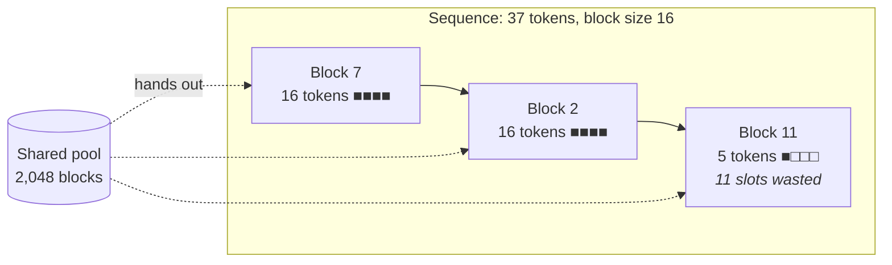

Waste is computed from the tokenized prompts of both conditions (309 long, 210 short) at the length each one reaches after 32 new tokens, through the cache's own `BlockTable`. The contiguous column reserves the workload's longest sequence for every request. That is the best a fixed preallocation can do, and it needs the lengths in advance.

<picture>
  <source media="(prefers-color-scheme: dark)" srcset="figures/block.dark.png">
  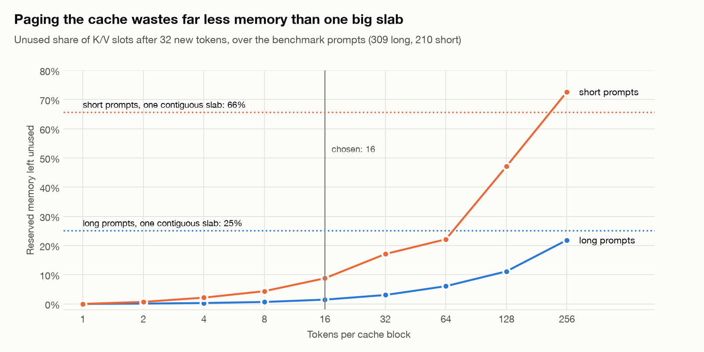
</picture>

| Block size | 1 | 2 | 4 | 8 | **16** | 32 | 64 | 128 | 256 | contiguous |
|:--|--:|--:|--:|--:|--:|--:|--:|--:|--:|--:|
| long: waste | 0.0% | 0.1% | 0.3% | 0.7% | **1.5%** | 3.1% | 6.1% | 11.2% | 21.9% | 25% |
| long: blocks per sequence (p50) | 478 | 239 | 120 | 60 | **30** | 15 | 8 | 4 | 2 | 1 |
| short: waste | 0.0% | 0.7% | 2.2% | 4.4% | **8.8%** | 17.1% | 22.2% | 47.1% | 72.7% | 66% |
| short: blocks per sequence (p50) | 56 | 28 | 14 | 7 | **4** | 2 | 1 | 1 | 1 | 1 |

The bookkeeping cost did not show up. Over 30 rounds on 30 long prompts, with all sizes interleaved, the cached baseline's p50 TPOT is 67.5–69.2 ms at block sizes 1, 4, 16, 64 and 256. The draft-model path's is 49.5–51.4 ms. Neither moves in step with the block size: block size 1, with 478 blocks per sequence, is no slower than 256. A decode step costs ~68 ms, and building a slot table from a few hundred integers is invisible next to it. The per-position K/V gather in `cache/kv.py` is the same work at every block size, so it does not show up here either.

Block size 16 stays. It wastes 1.5% on long prompts and 8.8% on short ones, against 25% and 66% for contiguous reservation. Nothing in this measurement argues for smaller blocks: below 16 there is less than 2% left to save on long prompts. At the speculative peak a sequence holds k = 4 more positions, just after a verify. That changes these figures by at most 0.2 points on long prompts and 3 points on short ones. On short prompts, a 256-slot block wastes more than contiguous reservation, because the longest short sequence needs only 204 slots.

---

## Batch size

At batch 1, a decode step mostly reads the weights, so verifying k + 1 positions costs little more than decoding one. As the batch grows, each step does more arithmetic per weight read, and the positions a rejected draft wasted start to cost real time. [`scripts/batch_size.py`](scripts/batch_size.py) measures how fast that erodes the advantage. Batches are decoded whole: plain cached decoding (`generate_batch`, tested equal to one-at-a-time decoding in fp64) against the speculative loop, at batch sizes 1, 2, 4 and 8. Every configuration is interleaved in the same rounds, with 2 warmup and 20 measured rounds per category.

> [!NOTE]
> **Intuition:** at batch 1 the GPU is mostly idle while it waits for memory, so speculation fills idle time for free. With 8 users at once the GPU is already busy, and every wrong guess now displaces real work.

The prompts are the short ones (9–167 tokens). On the 1.7B target, K/V costs 192 KiB per token, so eight 600-token sequences would need ~1 GB of cache next to 4.7 GiB of weights and buffers. That is past the 5.33 GiB MPS limit of this machine. Twenty rounds give a usable median but no p99.

<picture>
  <source media="(prefers-color-scheme: dark)" srcset="figures/batch.dark.png">
  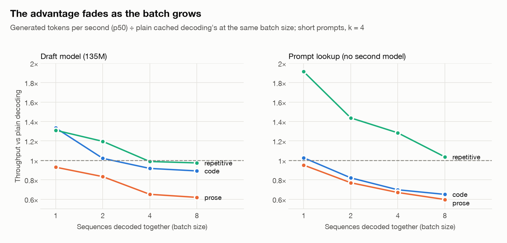
</picture>

Each speculative entry is its throughput (generated tokens per second, p50) divided by plain cached decoding's at the same batch size:

| Category | Method | α (mean over B) | B = 1 | B = 2 | B = 4 | B = 8 |
|:--|:--|--:|--:|--:|--:|--:|
| code | `spec_ngram` | 0.06 | 1.03× | 0.82× | 0.70× | 0.65× |
| code | `spec_draft` | 0.64 | 1.33× | 1.02× | 0.92× | 0.89× |
| code | `cached` tokens/s | | 17.8 | 33.8 | 61.8 | 101.5 |
| prose | `spec_ngram` | 0.04 | 0.95× | 0.77× | 0.67× | 0.60× |
| prose | `spec_draft` | 0.36 | 0.93× | 0.83× | 0.65× | 0.62× |
| prose | `cached` tokens/s | | 18.6 | 35.3 | 65.3 | 112.8 |
| repetitive | `spec_ngram` | 0.32 | 1.91× | 1.44× | 1.28× | 1.04× |
| repetitive | `spec_draft` | 0.69 | 1.31× | 1.20× | 0.99× | 0.97× |
| repetitive | `cached` tokens/s | | 17.3 | 31.1 | 51.4 | 76.4 |

- **At batch 1 the draft model wins only where it is accepted**: 1.33× on code (α 0.68), 1.31× on repetitive text (α 0.61), and 0.93× on prose (α 0.35). This agrees with the batch-1 benchmark above.
- **The advantage shrinks as the batch grows, in every category.** Plain cached decoding's throughput rises 5.7× from batch 1 to 8 on code and 6.1× on prose, because extra sequences ride on the same weight reads. The speculative loop scales less. By batch 4 the draft model is at or below plain decoding everywhere (0.65–0.99×), and at batch 8 it reaches 0.62–0.97×.
- **Prompt lookup holds up best on repetitive text**, where it costs no model: 1.91× at batch 1 and still 1.04× at batch 8. On code and prose its acceptance is 0.03–0.06, and it loses 35–40% by batch 8.
- In this loop, a round lasts as long as its slowest row needs: every active sequence verifies k + 1 positions, and the batch waits for the last one to finish. That cost grows with the batch too, and these numbers include it.

This sweep ran twice. The first run was taken overnight with the lid closed, so the Mac slept and ran it in ~40-second maintenance wakes from a cold start. Its repetitive category came out non-monotonic, and its cached throughput at batch 8 was 45 tokens/s against 76 awake. The prose and repetitive categories were remeasured with the machine awake, and the table uses the awake runs. Code had finished before the first sleep. The block-size sweep also had a 49-minute sleep in the middle. `perf_counter` does not count time asleep, but the rounds right after waking ran on a cold GPU. All block sizes were interleaved, so this cost lands on every size alike.

---

## Correctness

A speedup is worthless if the text changes. Four independent checks, from exact bit-level equality to statistical tests:

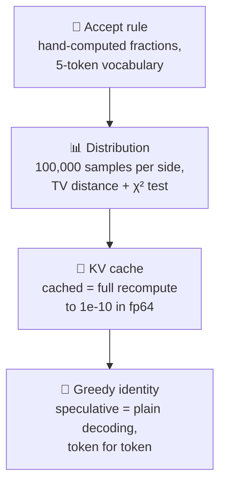

### Greedy identity

At temperature 0 the speculative loop must emit exactly the target's greedy sequence.

| Setup | Prompts | Tokens | Result |
|:--|--:|--:|:--|
| Tiny random Llama (2 layers, fp64), 1-layer early-exit draft, k = 4 | 200 | 24 | ✅ 200/200 identical (also batched at 8 and 25, and k = 1, 2, 3, 8) |
| SmolLM2-360M target / SmolLM2-135M draft, fp64, CPU | 50 | 16 | ✅ 50/50 identical |
| SmolLM2-1.7B target / SmolLM2-135M draft, bf16 weights, fp32 logits, Apple M3 (MPS) | 200 | 32 | ⚠️ 194/200 identical; all 6 flips are rounding (below) |
| Same, bf16 logits (before the fix below) | 200 | 32 | ❌ 187/200 identical |

The real-weight exact check uses the 360M target because the 1.7B needs 14 GiB in fp64. An earlier 32-token fp64 run was stopped at 78 prompts, with 78/78 identical, when the prompt count was cut to 50.

### bf16 flips are rounding, not the algorithm

In a 6-prompt smoke run on the 1.7B/135M pair in bf16, one prose prompt diverged at token 26. The reference's top two logits there are `' went'` 18.625 and `' then'` 18.5. Between 16 and 32 the bf16 grid spacing is 0.125, so the two candidates are one grid step apart. The verify pass runs k + 1 tokens through one matmul and plain decoding runs one token at a time. Those shapes round differently, and a one-step tie can come out either way. The same prompt is identical between cached and uncached plain decoding, and the n-gram draft diverges at the same position, which rules out the draft model.

```text
bf16 number line near 18.6 (spacing 0.125):

   18.375     18.5      18.625     18.75
  ───┼─────────┼─────────┼─────────┼───
             ' then'   ' went'
              └─ one grid step ─┘   ← a different matmul shape can round either way
```

An accept step that is too lenient would also flip near-ties, so a small logit gap does not excuse a flip by itself. Three conditions are asserted on the 200-prompt run:

- each flip's top-2 gap is at most two grid steps of the model's compute dtype;
- fewer than 5% of prompts flip;
- the flips do not favour the draft. Rounding picks a side of the tie without reference to the draft, so the emitted token is the draft's at most about half the time. In a simulated-rounding control on the tiny model the figure was 22–27%. A lenient accept emits the draft's token every time. The test uses a one-sided binomial test against 1/2. A known-bad verifier that accepts any draft within 0.001 of the max logit is caught by it: every flip emits the draft's token.

With bf16 logits the first run missed the second condition: 13 of 200 prompts flipped (6.5%). Seven of the 13 flips sat at an exact tie: the two candidates rounded to the same bf16 value, and argmax broke the tie differently in the two passes. The output projection now runs in fp32 for every method, the baselines included. The rerun flipped 6 of 200 (3.0%), with gaps between 0.001 and 0.071 logits (at most 1.14 grid steps) and no exact ties. One of the 6 flips emitted the draft's token (one-sided p = 0.98). What remains comes from bf16 hidden states, which fp32 logits do not change.

| Condition asserted | bf16 logits | fp32 logits (current) |
|:--|:--:|:--:|
| Every flip within 2 grid steps | ✅ | ✅ (max 1.14) |
| Fewer than 5% of prompts flip | ❌ 6.5% | ✅ 3.0% |
| Flips do not favour the draft | — | ✅ 1 of 6, p = 0.98 |

### Distribution preservation

On a 32-token vocabulary with k = 4 and 100,000 draws per side, speculative sampling matches plain sampling from the target within sampling noise. At position 0, total-variation distance is 0.0072 against an expected noise level of 0.0085, with a goodness-of-fit p of 0.134. Resampling from `p_target` instead of the residual `norm(max(0, p_target - p_draft))` gives a TV of 0.1684 and p = 0, so it is rejected. On a 5-token toy vocabulary, the accept and residual probabilities are asserted equal to hand-computed fractions under a shared random stream.

| Resampling rule on rejection | TV distance to target | Goodness-of-fit p | Verdict |
|:--|--:|--:|:--|
| Residual `norm(max(0, p − q))` (correct) | 0.0072 | 0.134 | ✅ matches (noise level 0.0085) |
| `p_target` (the tempting bug) | 0.1684 | 0 | ❌ rejected |

### KV cache equivalence

Cached decoding matches a full recomputation at every step to within 1e-10 in fp64. This holds for one sequence, for a padded batch of mixed lengths, and after a rollback. On real SmolLM2-135M weights in fp64 the maximum difference is 2.2e-14. In fp32 on the M3 it is 1.12e-4, which misses the 1e-4 criterion. The cause is that 1-token and n-token matmuls round differently, not the cache.

---

## Quick start

> [!IMPORTANT]
> Needs Python **3.12** and about **6 GB** of free memory for the 1.7B + 135M pair in bf16. Runs on Apple Silicon (MPS), CUDA, or CPU (slowly). The test suite alone needs no model download.

```bash
git clone https://github.com/beriltatli/speculative-decoder.git
cd speculative-decoder
python3.12 -m venv .venv && source .venv/bin/activate
pip install -r requirements.txt

# 1. The tests: tiny random models, no download, ~25 s.
#    Expect 260 passed, 4 failed: the documented benchmark sanity misses (see Sanity checks).
python -m pytest -q
```

Download the pinned model revisions into `models/` (about 3.7 GB; the revisions are the ones in [`config.yaml`](config.yaml)):

```bash
hf download HuggingFaceTB/SmolLM2-1.7B-Instruct --revision 31b70e2e869a7173562077fd711b654946d38674 --cache-dir models
hf download HuggingFaceTB/SmolLM2-135M-Instruct --revision 12fd25f77366fa6b3b4b768ec3050bf629380bac --cache-dir models
# only for the fp64 greedy-identity check:
hf download HuggingFaceTB/SmolLM2-360M-Instruct --revision a10cc1512eabd3dde888204e902eca88bddb4951 --cache-dir models
```

## Try it yourself

### In the terminal

```bash
python -m scripts.demo "Write a Python function that reverses a string."
python -m scripts.demo --max-new 96 --k 6 "First prompt" "Second prompt"
python -m scripts.demo --raw "Text to continue as-is, without the chat template"
```

For each prompt it runs plain decoding, the draft model and prompt lookup, prints the answer with accepted draft tokens in **green**, checks that all three produced the same tokens, and prints each one's time and speedup:

```text
Prompt: Write a Python function that checks whether a string is a palindrome.  (45 tokens)
Answer (green: proposed by the draft model and accepted by the target)
Here's a simple Python function that checks whether a string is a palindrome: ...

  method                   time   tok/s  speedup  accepted  same tokens
  plain decoding          2.97s    16.1    1.00×         –  yes
  draft model (135M)      1.69s    28.5    1.76×       82%  yes
  prompt lookup           2.74s    17.5    1.09×        7%  yes
```

### In the browser

```bash
python -m scripts.gui          # opens http://127.0.0.1:7860
```

A local playground built on the standard library only: type a prompt, pick the number of new tokens and k, and watch plain decoding and both speculative methods stream in, with accepted draft tokens highlighted. Requests run one at a time, because two would not fit next to the 1.7B on an 8 GB machine.

## Reproduce every number

| Command | Writes | Time on an M3 | What it measures |
|:--|:--|--:|:--|
| `python -m pytest -q` | — | ~25 s | 264 tests: accept rule, distribution, cache, rollback, paging, bonus token, benchmark math, and sanity checks on the recorded results |
| `python -m scripts.greedy_identity` | `results/greedy_identity.json` | hours | Token-for-token identity in fp64 (exact) and bf16 (main) |
| `python -m scripts.benchmark` | `results/latency.json` | ~5 h | The [speed](#speed) tables: 6 methods × 2 lengths × 3 categories × 100 rounds |
| `python -m scripts.block_size` | `results/block_size.json` | hours | The [block-size](#cache-block-size) sweep |
| `python -m scripts.batch_size` | `results/batch_size.json` | hours | The [batch-size](#batch-size) sweep |
| `python -m scripts.figures` | `figures/*.png`, `race.gif`, `race.mp4` | seconds | Every chart in this README, from the JSON above |

Every long script takes `--tiny` to run end to end on random tiny models in seconds (the numbers then mean nothing), and the long ones resume where they stopped if interrupted.

> [!CAUTION]
> On an 8 GB Mac the benchmark holds ~5.2 GB. Close other apps, keep the lid open (a sleeping Mac produced [unusable runs](#batch-size)), and watch swap: a GPU "Insufficient Memory" error on MPS does not raise, it silently corrupts results.

### Reproducibility

| | |
|:--|:--|
| **Hardware** | Apple M3, 8 GB unified memory, integrated GPU via MPS (5.33 GiB cap) |
| **Software** | macOS 26.3.1 · Python 3.12.6 · torch 2.14.1 · transformers 5.18.0 · numpy 2.5.3 · scipy 1.18.1 |
| **Models** | SmolLM2-1.7B-Instruct `31b70e2` · SmolLM2-135M-Instruct `12fd25f` · SmolLM2-360M-Instruct `a10cc15`, all pinned by revision |
| **Seed** | 0 ([`config.yaml`](config.yaml)) |
| **Provenance** | Each results file records the git commit and a dirty flag; `latency.json` was measured at `b83858f`, clean |
| **Prompts** | [`prompts/build.py`](prompts/build.py) and [`prompts/build_long.py`](prompts/build_long.py) regenerate the prompt files byte for byte: CPython 3.12 stdlib for code, six Project Gutenberg novels for prose, generated logs/CSV/configs for repetitive |

---

## Project map

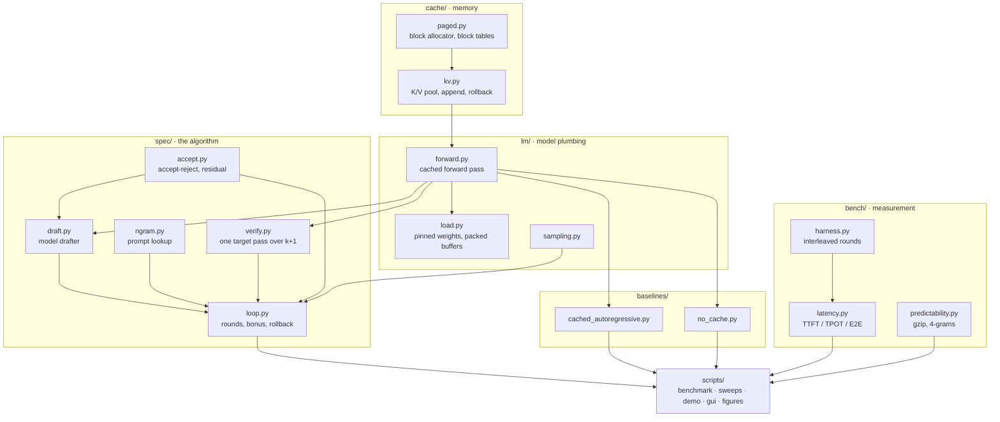

Arrows point from a module to the modules that import it.

| Path | Lines | What lives there |
|:--|--:|:--|
| [`spec/`](spec) | 375 | The algorithm: drafting (model and prompt lookup), verification, accept-reject, the round loop with rollback and bonus token |
| [`cache/`](cache) | 232 | Paged KV cache: block allocator, block tables, K/V pool, rollback |
| [`lm/`](lm) | 243 | Loading pinned models, the cached forward pass, fp32 output head |
| [`baselines/`](baselines) | 125 | Plain decoding with and without the cache, single and batched |
| [`bench/`](bench) | 334 | Harness with interleaved, shuffled rounds; latency definitions; predictability measures |
| [`scripts/`](scripts) | 1,400+ | Benchmarks, sweeps, demo, web playground, figure generation |
| [`tests/`](tests) | 1,300+ | 264 tests, run on every push by [CI](.github/workflows/ci.yml) (red while the 4 documented sanity misses stand) |
| [`results/`](results) | — | Every measured JSON the README quotes |
| [`figures/`](figures) | — | Charts (light and dark), the animation, and its trace |
| [`media/`](media) | — | The 4-minute video explainer |

---

## Roadmap

| Phase | Scope | Status |
|:--:|:--|:--:|
| 0 | Repository hygiene, exact pins, CI | ✅ |
| 1 | Paged KV cache, cached forward, no-cache baseline, equivalence tests | ✅ |
| 2 | Accept-reject step with exact and statistical distribution tests | ✅ |
| 3 | Draft-verify loop: rollback, bonus token, n-gram draft, greedy identity | ✅ |
| 4 | Latency benchmark: 6 methods, 2 prompt lengths, 3 text categories | ✅ |
| 5 | Block-size and batch-size sweeps | ✅ |
| 6 | Not yet scoped | ⏳ |

Open leads the measurements point to:

- [ ] **Close the gap to `transformers`' assisted generation.** Profile the per-layer K/V gather copy in `cache/kv.py` and the per-step device-to-host copy of draft distributions.
- [ ] **Fix the 4-gram predictability measure**, which reads 0.00 on log lines: compute it over tokens or with a smaller n.
- [ ] **Rerun the long-prompt tails** with other apps closed; the current p99s mostly measure swap.

---

## FAQ

<details>
<summary><b>If the output is identical, where does the speed come from?</b></summary>

From doing the big model's work in fewer, wider steps. Checking 5 tokens in one pass costs little more than producing 1, because on a laptop a pass is limited by reading 1.7 billion weights from memory, not by the arithmetic. Every accepted guess is a pass the big model does not have to make.
</details>

<details>
<summary><b>Why is it sometimes slower?</b></summary>

Every round pays for the guesser (4 small-model passes, or a string search) and for a verify pass. If most guesses are rejected, as on creative prose where the next word is genuinely uncertain, that overhead buys almost nothing. See the [break-even line](#speed).
</details>

<details>
<summary><b>Why does prompt lookup do so well on logs?</b></summary>

Log lines repeat their structure: after `GET /index.html` comes ` 200 OK` again. Prompt lookup just finds where the current text appeared before and copies what followed. That costs nothing, so even modest acceptance turns into speed.
</details>

<details>
<summary><b>Why test at temperature 0 and at temperature > 0 separately?</b></summary>

At temperature 0 the target's choice is deterministic, so the output can be compared token for token. With sampling, two runs differ even without speculation, so the test compares *distributions* over 100,000 samples instead.
</details>

<details>
<summary><b>Why only 32 new tokens per benchmark call?</b></summary>

With 100 measured rounds per cell, the no-cache floor costs ~23 s per call on 450-token prompts. 64 tokens would have put the run near 8 hours on the M3.
</details>

<details>
<summary><b>Why SmolLM2?</b></summary>

The draft and target must share a vocabulary (checked at load by `lm.load.check_shared_vocab`), and both had to fit in 8 GB together. The SmolLM2 family has a 135M, 360M and 1.7B model with the same 49,152-token vocabulary.
</details>

---

## References

1. Y. Leviathan, M. Kalman, Y. Matias. *Fast Inference from Transformers via Speculative Decoding.* ICML 2023. [arXiv:2211.17192](https://arxiv.org/abs/2211.17192)
2. C. Chen, S. Borgeaud, G. Irving, J.-B. Lespiau, L. Sifre, J. Jumper. *Accelerating Large Language Model Decoding with Speculative Sampling.* 2023. [arXiv:2302.01318](https://arxiv.org/abs/2302.01318)
3. A. Saxena. *Prompt Lookup Decoding.* 2023. [github.com/apoorvumang/prompt-lookup-decoding](https://github.com/apoorvumang/prompt-lookup-decoding)
4. W. Kwon et al. *Efficient Memory Management for Large Language Model Serving with PagedAttention.* SOSP 2023. [arXiv:2309.06180](https://arxiv.org/abs/2309.06180)
5. L. Ben Allal et al. *SmolLM2: When Smol Goes Big.* 2025. [arXiv:2502.02737](https://arxiv.org/abs/2502.02737)

## License

[MIT](LICENSE) © 2026 beriltatli
